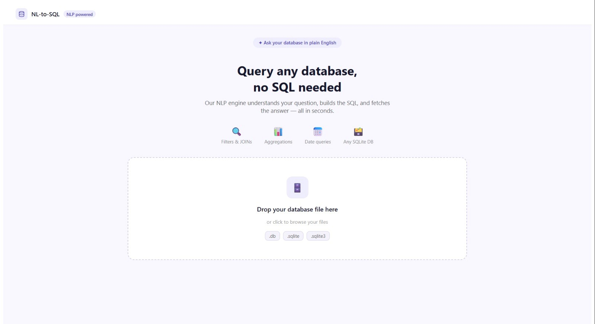
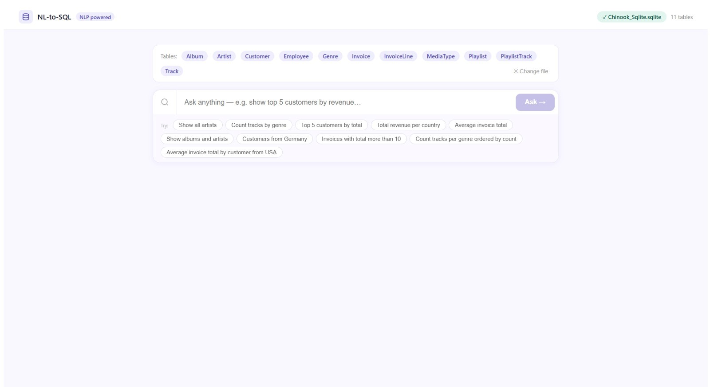
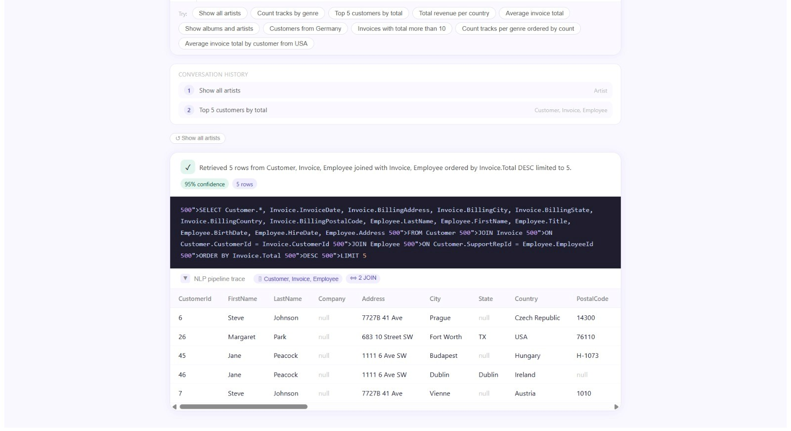

# Universal NL-SQL

A simple Natural Language to SQL application that allows users to upload a SQLite database and ask questions about the data using plain English.

## Screenshots

### Home Page



### Natural Language Query



### Query Result



## Features

* Upload SQLite databases
* Ask questions in natural language
* Automatically understand the database schema
* Convert natural language questions into SQL queries
* Execute the generated SQL query
* Display query results
* Support conversational/follow-up questions
* Use Ollama with Phi-3 for complex queries

## Technologies Used

* **Python**
* **FastAPI**
* **SQLAlchemy**
* **spaCy**
* **scikit-learn**
* **SQLite**
* **Ollama / Phi-3**
* **React**
* **Vite**
* **JavaScript**

## How It Works

1. Upload a SQLite database.
2. The system reads and understands the database schema.
3. Enter a question in plain English.
4. The NLP engine identifies the required tables, columns, filters, sorting, grouping, and other query details.
5. The system generates the corresponding SQL query.
6. The SQL query is executed on the database.
7. The result is displayed to the user.
8. For complex queries, Ollama with Phi-3 can be used as a fallback.

## Example Questions

```text
Show all customers.

How many customers are there?

Show the top 5 products by price.

Find customers from Germany.

What is the average price of the products?

Show total sales grouped by customer.
```

## Project Structure

```text
universal_nl_sql/
│
├── backend/
│   ├── main.py
│   ├── nlp_engine.py
│   ├── db_executor.py
│   ├── schema_inspector.py
│   ├── llm_bridge.py
│   ├── session_memory.py
│   └── requirements.txt
│
├── frontend/
│   ├── src/
│   ├── public/
│   ├── package.json
│   └── vite.config.js
│
└── README.md
```

## Installation

### Backend

Go to the backend folder:

```bash
cd backend
```

Create a virtual environment:

```bash
python -m venv venv
```

Activate it on Windows:

```bash
venv\Scripts\activate
```

Install the required packages:

```bash
pip install -r requirements.txt
```

Install the spaCy English model:

```bash
python -m spacy download en_core_web_sm
```

Start the backend:

```bash
uvicorn main:app --reload
```

The backend will run at:

```text
http://127.0.0.1:8000
```

### Frontend

Open another terminal and go to the frontend folder:

```bash
cd frontend
```

Install dependencies:

```bash
npm install
```

Start the frontend:

```bash
npm run dev
```

Open the local URL provided by Vite in your browser.

## Ollama Setup

Ollama is optional and is used as a fallback for complex natural-language queries.

Install Ollama and run the Phi-3 model:

```bash
ollama run phi3
```

The application expects Ollama to run on:

```text
http://localhost:11434
```

## API Endpoints

| Method | Endpoint         | Description                          |
| ------ | ---------------- | ------------------------------------ |
| GET    | `/ping`          | Check whether the backend is running |
| POST   | `/upload-db`     | Upload a SQLite database             |
| POST   | `/ask`           | Ask a natural-language question      |
| POST   | `/clear-session` | Clear the current conversation       |
| GET    | `/schema`        | Get database schema information      |

## Notes

* The application currently works with SQLite databases.
* Ollama is optional.
* Avoid uploading sensitive or private databases.
* Do not commit your virtual environment or sensitive files to GitHub.

## Author

Developed as a project for exploring **Natural Language Processing, SQL generation, and conversational database querying**.
